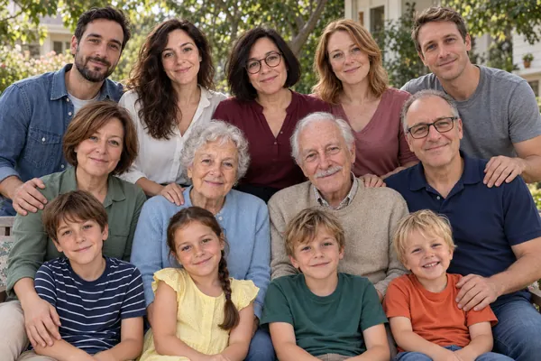
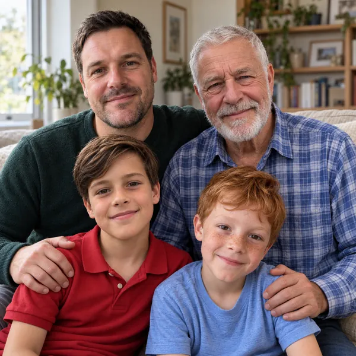
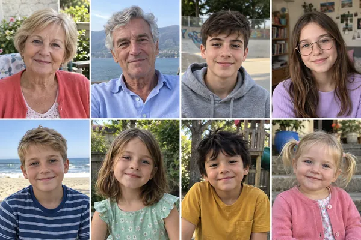
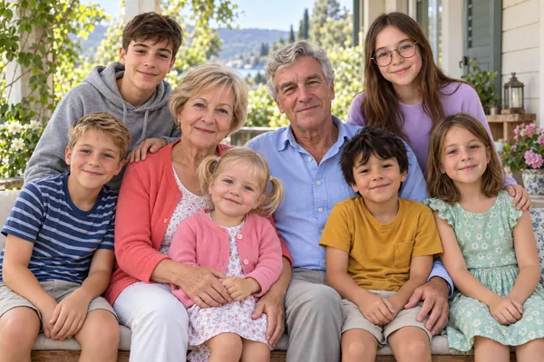
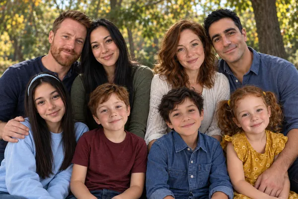

# Шесть семейных примеров из разных фотографий

Все люди и исходные снимки вымышлены и созданы с помощью ИИ. Это демонстрационные примеры, а не реальные клиентские заказы.

В каждой карточке два изображения: подборка отдельных исходных снимков и объединённый семейный портрет. Веб-версии и миниатюры сохранены в WebP без обрезки композиции.

После добавления: **113 карточек** в общей галерее, **12** в категории «Семья из разных фото». Первые 15 работ сохраняют прежний порядок; новая шестёрка размещена сразу после них. Карточка с лабрадором также доступна в фильтре «Питомцы».

Материалы подготовлены встроенным инструментом генерации изображений. [Полный набор запросов генерации](family-prompts-2026-09-29.json).

## 1. Большая семья — 13 человек из разных фото

Мама и папа, две взрослые дочери с мужьями, четверо детей (мальчик и девочка у одной пары, два мальчика у другой), сестра мамы, бабушка и дедушка. Всего 13 человек: 9 взрослых и 4 ребёнка.

| Отдельные исходники | Общий портрет |
| --- | --- |
|  |  |

## 2. Три поколения — папа, дедушка и двое внуков

Папа, дедушка и двое мальчиков-внуков. Всего 4 человека.

| Отдельные исходники | Общий портрет |
| --- | --- |
|  |  |

## 3. Бабушка, дедушка и шестеро внуков

Бабушка, дедушка и шестеро внуков разного возраста. Всего 8 человек.

| Отдельные исходники | Общий портрет |
| --- | --- |
|  |  |

## 4. Родители, малыш и лабрадор

Молодые родители, малыш и лабрадор. Три человека и одна собака.

| Отдельные исходники | Общий портрет |
| --- | --- |
|  |  |

## 5. Брат и сестра со своими семьями

Брат с женой и двумя детьми; сестра с мужем и двумя детьми. Всего 8 человек.

| Отдельные исходники | Общий портрет |
| --- | --- |
|  |  |

## 6. Семейный юбилей — родители и взрослые дети

Родители и трое взрослых детей — два сына и дочь. Всего 5 человек.

| Отдельные исходники | Общий портрет |
| --- | --- |
|  |  |

## Состояние реализации

Карточки используют существующий фильтр `family-composite` и просмотр изображений. Для новых работ выводится явная подпись «ИИ-пример · вымышленные персонажи».

Изменены только данные галереи, поддержка подписи в её карточках и версии подключаемых сценариев на главной странице. Код Метрики сохранён; обработчики заказов и приватные настройки не изменены. Вёрстка уже использует `object-fit: contain`, поэтому широкие групповые портреты показываются целиком.

Перед переносом на основной хостинг требуется согласование изображений и повторная сверка затрагиваемых файлов с хостингом. Эта подготовка сама по себе не обновляет рабочий сайт.
