# Шесть семейных примеров из разных фотографий

Все люди, исходные снимки и сцены демонстрации холста вымышлены и созданы с помощью ИИ. Это демонстрационные примеры, а не реальные клиентские заказы или отзывы.

В каждой карточке три изображения: подборка отдельных исходных снимков, объединённый семейный портрет и готовый холст. В четырёх карточках два взрослых члена семьи держат холст; в двух показано размещение картины в интерьере. Веб-версии и миниатюры сохранены в WebP без обрезки композиции.

В общей галерее **113 карточек**, в категории «Семья из разных фото» — **12**. Первые 15 работ сохраняют прежний порядок; новая шестёрка размещена сразу после них. Карточка с лабрадором также доступна в фильтре «Питомцы».

[Первоначальные запросы генерации](family-prompts-2026-09-29.json) · [Запросы этой доработки](family-revision-prompts-2026-09-29.json)

## 1. Большая семья — 13 человек из разных фото

Мама и папа, две взрослые дочери с мужьями, четверо детей (мальчик и девочка у одной пары, два мальчика у другой), сестра мамы, бабушка и дедушка. Всего 13 человек: 9 взрослых и 4 ребёнка. Парадный интерьер театра, вечерние платья и костюмы. На третьем изображении мама и папа демонстрируют готовый холст.

| Отдельные исходники | Общий портрет | Готовый холст |
| --- | --- | --- |
| [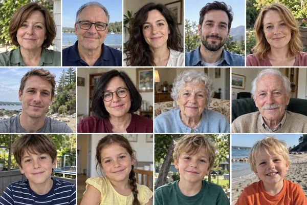](../assets/images/family-20260929/family-large-13-source.webp) | [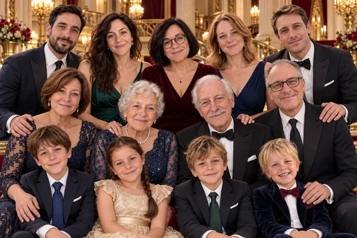](../assets/images/family-20260929/family-large-13-art-v2.webp) | [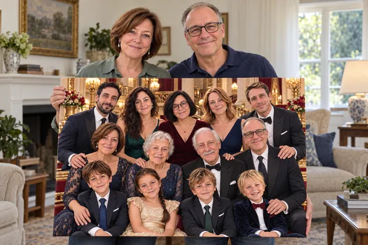](../assets/images/family-20260929/family-large-13-result.webp) |

## 2. Три поколения — папа, дедушка и двое внуков

Папа, дедушка и двое мальчиков-внуков в столярной мастерской. Всего 4 человека. На третьем изображении папа и дедушка держат готовый квадратный холст.

| Отдельные исходники | Общий портрет | Готовый холст |
| --- | --- | --- |
| [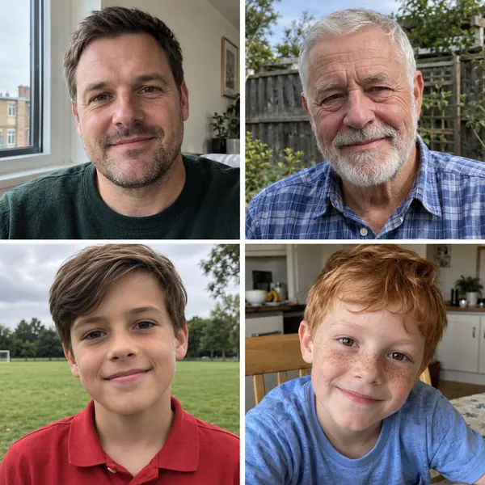](../assets/images/family-20260929/family-men-three-generations-source.webp) | [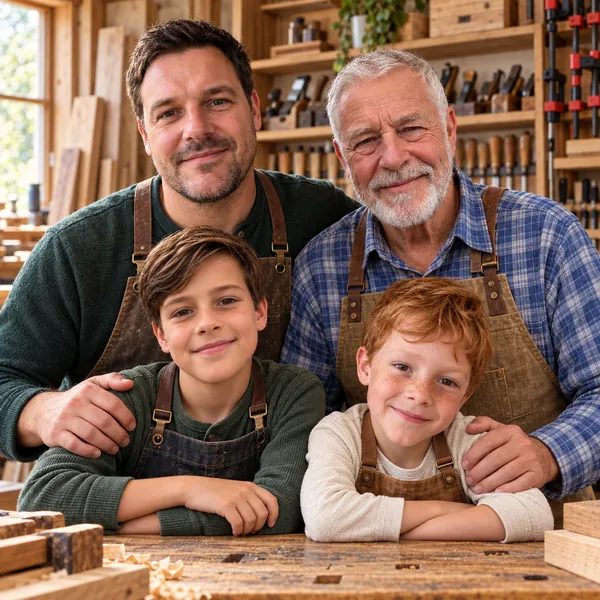](../assets/images/family-20260929/family-men-three-generations-art-v2.webp) | [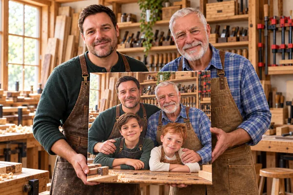](../assets/images/family-20260929/family-men-three-generations-result.webp) |

## 3. Бабушка, дедушка и шестеро внуков

Пожилые бабушка и дедушка в простой деревенской одежде с шестью внуками в интерьере загородной дачи. Всего 8 человек. Общий портрет квадратный. Возраст и одежда бабушки и дедушки согласованы с обновлёнными отдельными исходниками. На третьем изображении они демонстрируют готовый холст.

| Отдельные исходники | Общий портрет | Готовый холст |
| --- | --- | --- |
| [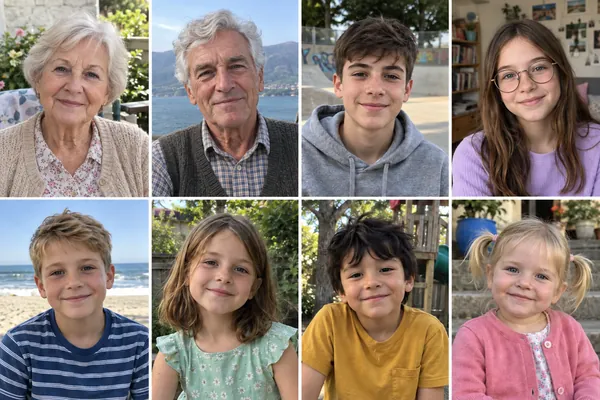](../assets/images/family-20260929/family-six-grandchildren-source-v2.webp) | [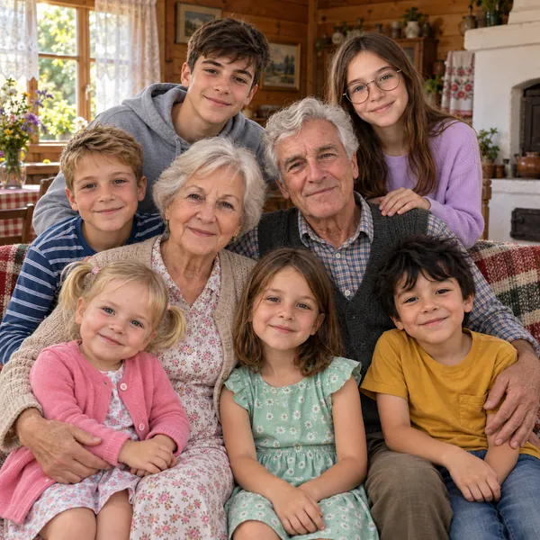](../assets/images/family-20260929/family-six-grandchildren-art-v2.webp) | [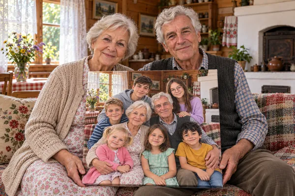](../assets/images/family-20260929/family-six-grandchildren-result.webp) |

## 4. Родители, малыш и лабрадор

Молодые родители, малыш и лабрадор. Три человека и одна собака. Общий портрет сохранён. На третьем изображении мама и папа держат квадратный холст с этим портретом.

| Отдельные исходники | Общий портрет | Готовый холст |
| --- | --- | --- |
| [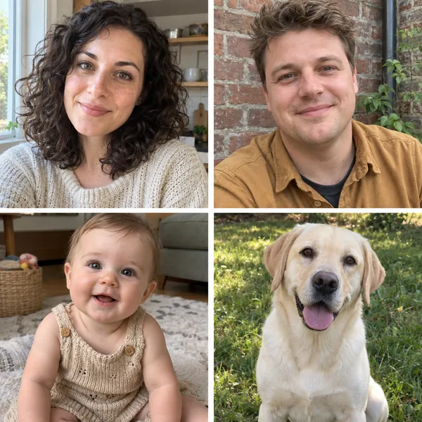](../assets/images/family-20260929/family-baby-labrador-source.webp) | [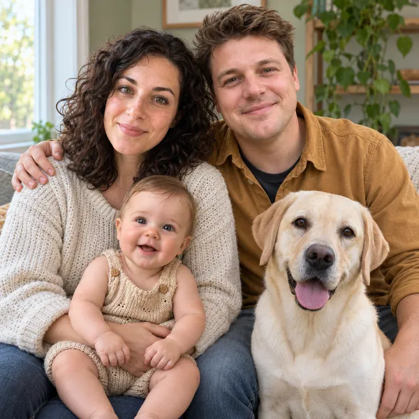](../assets/images/family-20260929/family-baby-labrador-art.webp) | [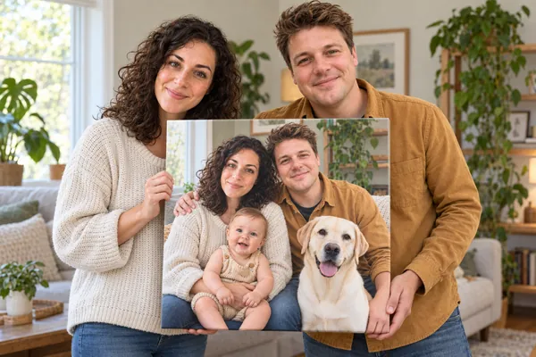](../assets/images/family-20260929/family-baby-labrador-result.webp) |

## 5. Брат и сестра со своими семьями

Брат с женой и двумя детьми; сестра с мужем и двумя детьми. Всего 8 человек. Зимний отдых в горах. На третьем изображении холст расположен на стене в интерьере шале.

| Отдельные исходники | Общий портрет | Готовый холст |
| --- | --- | --- |
| [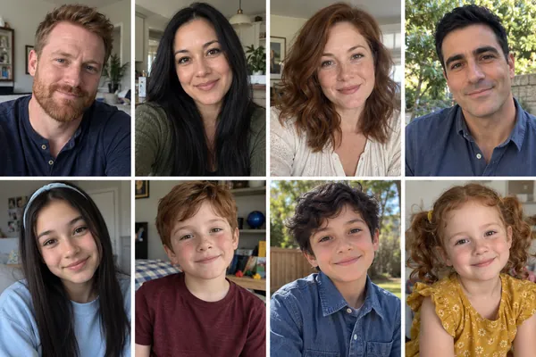](../assets/images/family-20260929/family-siblings-households-source.webp) | [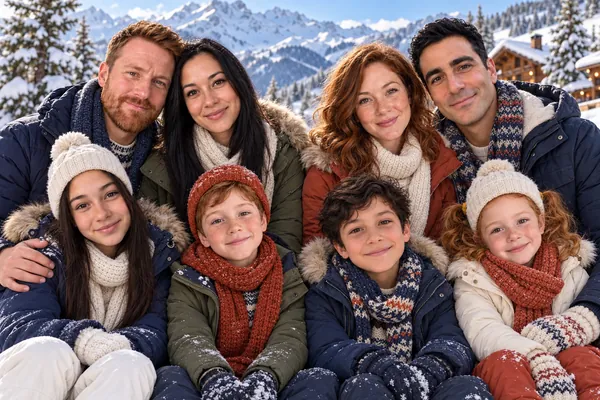](../assets/images/family-20260929/family-siblings-households-art-v2.webp) | [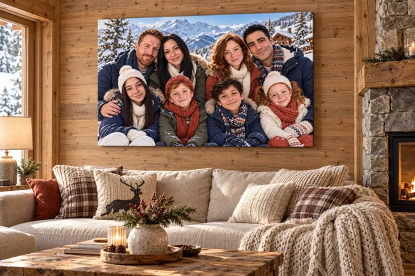](../assets/images/family-20260929/family-siblings-households-room.webp) |

## 6. Семейный юбилей — родители и взрослые дети

Родители и трое взрослых детей — два сына и дочь. Всего 5 человек. Общий портрет сохранён. На третьем изображении квадратный холст размещён в домашней гостиной.

| Отдельные исходники | Общий портрет | Готовый холст |
| --- | --- | --- |
| [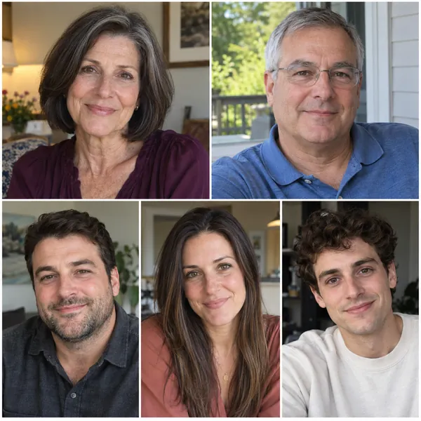](../assets/images/family-20260929/family-parents-anniversary-source.webp) | [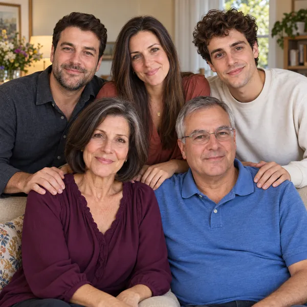](../assets/images/family-20260929/family-parents-anniversary-art.webp) | [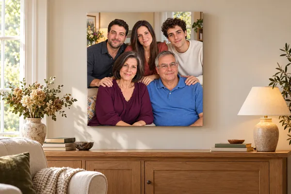](../assets/images/family-20260929/family-parents-anniversary-room.webp) |

## Состояние реализации

Карточки используют существующий фильтр `family-composite` и просмотр изображений. Для новых работ выводится подпись «ИИ-пример · вымышленные персонажи». Третье изображение доступно в полосе миниатюр и в просмотрщике.

В этой доработке изменены данные шести карточек, версия `works.js` на главной странице и иллюстрации. Код Метрики сохранён; обработчики заказов, приватные настройки и `messenger.html` не изменены. Вёрстка использует `object-fit: contain`, поэтому широкие групповые портреты показываются целиком.

Перед переносом на основной хостинг требуется согласование изображений и повторная сверка затрагиваемых файлов с хостингом. Доработка предназначена для проверки на демосайте GitHub.
